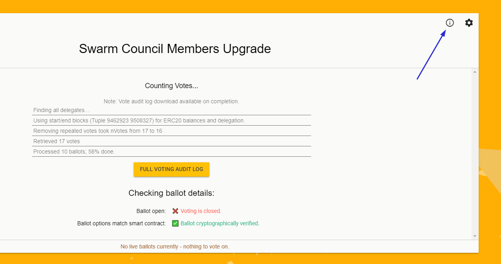
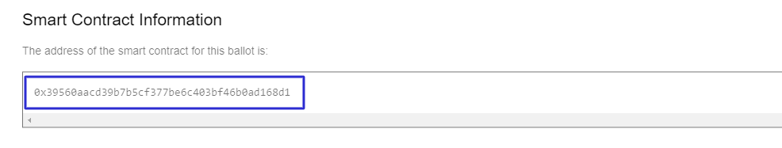
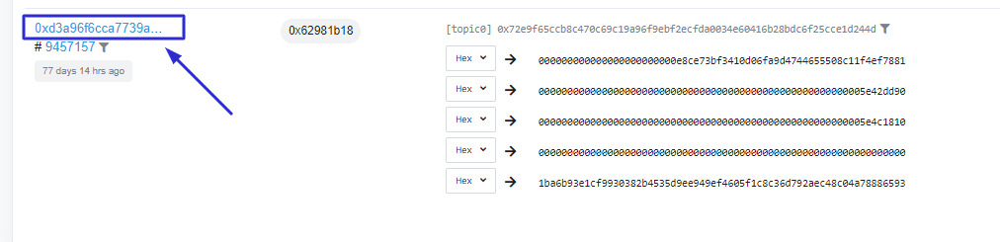
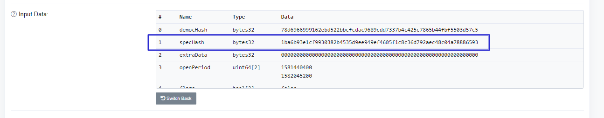

# Retrieving the text of previous ballots

**How do I retrieve the text of previous ballots?**

At [https://voting.swarmnetwork.org](https://voting.swarmnetwork.org/?enableDumpMasternodeDetails=true) you will find the [{ballot-address}](https://archive.secure.vote/0x%7BTXID%7D.json) smart contract for each ballot when clicking the “i" icon of each ballot.

Go to the "Events” tab in etherscan with [https://etherscan.io/address/](https://etherscan.io/address/%7Baddress%7D#events)[{ballot-address}](https://archive.secure.vote/0x%7BTXID%7D.json)\#events , then scroll down to the earliest transaction of the contract. Click the Txn Hash to see more details about the transaction.

The first event has details about the ballot instantiation. _Click to see More_. One of the data \(typically the last one\) will be the only one to have a 32 bytes [{TXID}](https://archive.secure.vote/0x%7BTXID%7D.json). It should be labelled _specHash_.

Copy the hash and then go to [https://archive.secure.vote/0x{TXID}.json](https://archive.secure.vote/0x%7BTXID%7D.json)  
That will get you the “BallotSpec”, which you can download and open it with a text editor to see the details

