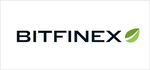

# SWM token

The SWM token is the **essential element**, which powers the SWARM ecosystem

## SWM Utility

**MASTERNODE STAKE: Help Build the Network** - Masternode operators stake SWM, committing to building and maintaining decentralized infrastructure for security tokens. Operators earn rewards for running the SWARM core software and for validating transactions. [Learn more here.](https://www.swarmmasternodes.com/)

**ISSUANCE STAKE: Tokenization is Free -** Token issuers stake SWM after a successful STO in order to trigger the release of raised funds, to mint security tokens, and to access services provided by the SWARM network. Staked amounts remain in the custody of token issuers and are released at the end of the life of the investment.

**GOVERNANCE: Participate and be heard -** Participate in votes and voice your opinion on how the Swarm network should be run including contributing to policy decisions affecting staking, masternodes, and rewards. Your SWM is your vote. Governance of the network by the SWM token holder community is a core objective of the SWARM Organization.

## Metrics

|  |  |
| :--- | :--- |
| **Blockchain** | Ethereum |
| **Total Supply** | 100,000,000 SWM |
| **Total Masternode Rewards** | 10,000,000 SWM |
| **Token contract** | \*\*\*\*[Token Tracker](https://etherscan.io/address/0x3505f494c3f0fed0b594e01fa41dd3967645ca39) |

## Get SWM

     

